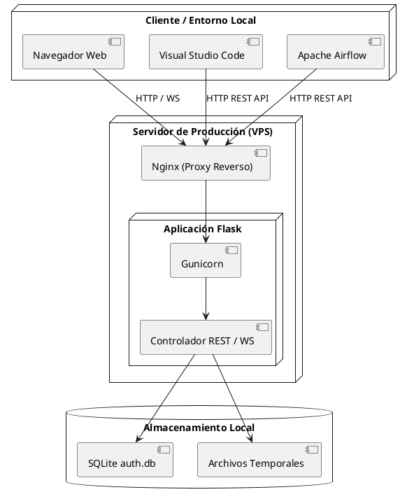
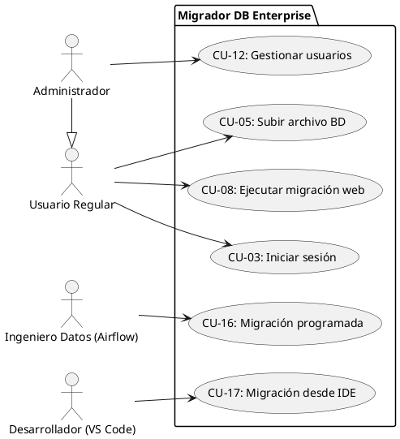
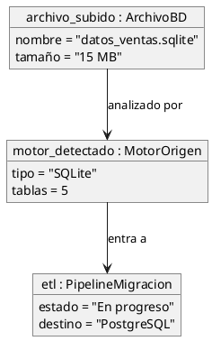
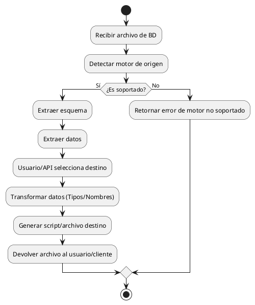
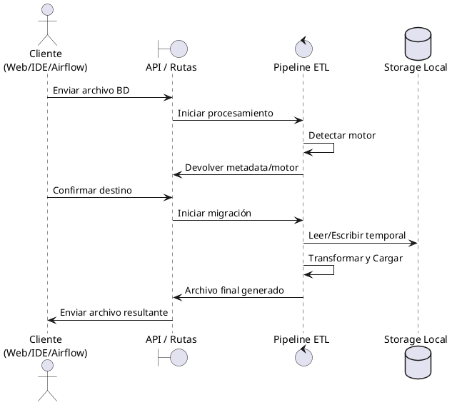
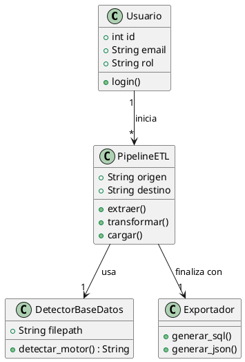

{width="1.0879997812773403in" height="1.4625557742782151in"}

**UNIVERSIDAD PRIVADA DE TACNA**

**FACULTAD DE INGENIERIA**

**Escuela Profesional de Ingeniería de Sistemas**

**Proyecto *Migrador DB Enterprise - Sistema de Migración de Bases de Datos***

Curso: *Ingeniería de Software (SI783)*

Docente: *Mag. Patrick José Cuadros Quiroga*

Integrantes:

***LLica Mamani, Jimmy Mijair***
***Halanocca Rojas, Usher Damiron***

**Tacna – Perú**

***2026***

**\**

<table>
<colgroup>
<col style="width: 10%" />
<col style="width: 12%" />
<col style="width: 15%" />
<col style="width: 16%" />
<col style="width: 11%" />
<col style="width: 33%" />
</colgroup>
<tbody>
<tr>
<td colspan="6" style="text-align: center;">CONTROL DE VERSIONES</td>
</tr>
<tr>
<td style="text-align: center;">Versión</td>
<td style="text-align: center;">Hecha por</td>
<td style="text-align: center;">Revisada por</td>
<td style="text-align: center;">Aprobada por</td>
<td style="text-align: center;">Fecha</td>
<td style="text-align: center;">Motivo</td>
</tr>
<tr>
<td style="text-align: center;">1.0</td>
<td style="text-align: center;">JLM / UHR</td>
<td style="text-align: center;">JLM</td>
<td style="text-align: center;">UHR</td>
<td style="text-align: center;">06/06/2026</td>
<td style="text-align: center;">Versión Original</td>
</tr>
<tr>
<td style="text-align: center;">2.0</td>
<td style="text-align: center;">JLM / UHR</td>
<td style="text-align: center;">JLM</td>
<td style="text-align: center;">UHR</td>
<td style="text-align: center;">04/07/2026</td>
<td style="text-align: center;">Actualización Unidad 3: integración Apache Airflow y extensión VS Code</td>
</tr>
</tbody>
</table>

Sistema *Migrador DB Enterprise*

Documento de Especificación de Requerimientos de Software

Versión *1.0*

**\**

<table>
<colgroup>
<col style="width: 10%" />
<col style="width: 12%" />
<col style="width: 15%" />
<col style="width: 16%" />
<col style="width: 11%" />
<col style="width: 33%" />
</colgroup>
<tbody>
<tr>
<td colspan="6" style="text-align: center;">CONTROL DE VERSIONES</td>
</tr>
<tr>
<td style="text-align: center;">Versión</td>
<td style="text-align: center;">Hecha por</td>
<td style="text-align: center;">Revisada por</td>
<td style="text-align: center;">Aprobada por</td>
<td style="text-align: center;">Fecha</td>
<td style="text-align: center;">Motivo</td>
</tr>
<tr>
<td style="text-align: center;">1.0</td>
<td style="text-align: center;">JLM / UHR</td>
<td style="text-align: center;">JLM</td>
<td style="text-align: center;">UHR</td>
<td style="text-align: center;">06/06/2026</td>
<td style="text-align: center;">Versión Original</td>
</tr>
<tr>
<td style="text-align: center;">2.0</td>
<td style="text-align: center;">JLM / UHR</td>
<td style="text-align: center;">JLM</td>
<td style="text-align: center;">UHR</td>
<td style="text-align: center;">04/07/2026</td>
<td style="text-align: center;">Actualización Unidad 3: integración Apache Airflow y extensión VS Code</td>
</tr>
</tbody>
</table>

**INDICE GENERAL**

#  {#section .TOC-Heading}

[INTRODUCCION](#introduccion) 

[I. Generalidades del Proyecto](#generalidades-del-proyecto)

[1. Nombre del Proyecto](#nombre-del-proyecto)

[2. Visión](#vision-del-proyecto)

[3. Misión](#mision-del-proyecto)

[4. Organigrama](#organigrama)

[II. Visionamiento del Proyecto](#visionamiento-del-proyecto)

[1. Descripción del Problema](#descripcion-del-problema)

[2. Objetivos de Negocios](#objetivos-de-negocios)

[3. Objetivos de Diseño](#objetivos-de-diseno)

[4. Alcance del proyecto](#alcance-del-proyecto)

[5. Viabilidad del Sistema](#viabilidad-del-sistema)

[6. Información obtenida del Levantamiento de Información](#informacion-obtenida)

[III. Análisis de Procesos](#analisis-de-procesos)

[a) Diagrama del Proceso Actual](#proceso-actual)

[b) Diagrama del Proceso Propuesto](#proceso-propuesto)

[IV. Especificación de Requerimientos de Software](#especificacion-requerimientos)

[a) Cuadro de Requerimientos funcionales](#requerimientos-funcionales)

[b) Cuadro de Requerimientos No funcionales](#requerimientos-no-funcionales)

[c) Reglas de Negocio](#reglas-de-negocio)

[V. Fase de Desarrollo](#fase-de-desarrollo)

[1. Perfiles de Usuario](#perfiles-de-usuario)

[2. Modelo Conceptual](#modelo-conceptual)

[CONCLUSIONES](#conclusiones-srs)

[RECOMENDACIONES](#recomendaciones-srs)

[BIBLIOGRAFIA](#bibliografia-srs)

[WEBGRAFIA](#webgrafia-srs)

---

## INTRODUCCION

El presente documento detalla la Especificación de Requerimientos de Software (SRS) para el sistema Migrador DB Enterprise en su versión 2.0, que abarca las tres unidades de desarrollo del proyecto. Este documento describe los requerimientos funcionales y no funcionales del sistema, los perfiles de usuario, los procesos involucrados y las reglas de negocio que rigen su funcionamiento.

Migrador DB Enterprise fue concebido para resolver la problemática de la migración de datos entre sistemas de gestión de bases de datos heterogéneos, proporcionando una solución automatizada basada en el paradigma ETL (Extracción, Transformación y Carga). En la Unidad 3 se extendió el alcance del sistema con dos integraciones clave: el operador `MigradorDBOperator` para Apache Airflow, que permite orquestar migraciones como DAGs, y la extensión oficial para Visual Studio Code, que permite ejecutar migraciones directamente desde el IDE.

---

## I. Generalidades del Proyecto

### 1. Nombre del Proyecto

Migrador DB Enterprise – Sistema Integral de Migración de Bases de Datos

### 2. Visión

Ser la plataforma de referencia en migración multi-motor de bases de datos de código abierto, democratizando el acceso a procesos ETL automatizados para desarrolladores, administradores de bases de datos y organizaciones de todos los tamaños, integrable en cualquier flujo de trabajo profesional mediante extensiones para IDE y orquestadores de datos.

### 3. Misión

Facilitar la migración segura, eficiente y precisa de datos entre más de 15 motores de bases de datos mediante una interfaz web intuitiva, detección automática de motores, generación de exportaciones nativas para cada plataforma, y extensibilidad a entornos de desarrollo (VS Code) y orquestación de datos empresariales (Apache Airflow).

### 4. Organigrama

| Rol | Integrante | Responsabilidades |
|:----|:-----------|:------------------|
| Desarrollador Backend / ETL + Airflow | LLica Mamani, Jimmy Mijair | Módulos de extracción, transformación, carga, detección automática, tests, desarrollo del paquete `migradordb-airflow` y publicación en PyPI |
| Desarrollador Frontend / Auth + VS Code Ext. | Halanocca Rojas, Usher Damiron | Interfaz web, autenticación, OAuth, integración GitHub, plantillas HTML, desarrollo y publicación de la extensión oficial de VS Code |

---

## II. Visionamiento del Proyecto

### 1. Descripción del Problema

Las organizaciones enfrentan constantemente la necesidad de migrar datos entre diferentes motores de bases de datos. Este proceso, realizado manualmente, presenta múltiples desafíos:

- Cada motor tiene su propia sintaxis SQL, tipos de datos y características.
- Las herramientas comerciales son costosas y generalmente soportan solo 2-3 motores.
- Los procesos manuales son lentos, propensos a errores y difíciles de reproducir.
- No existe detección automática del tipo de archivo en la mayoría de herramientas.

### 2. Objetivos de Negocios

- Reducir el tiempo de migración de días a minutos.
- Eliminar la dependencia de herramientas comerciales costosas.
- Proporcionar una solución multi-motor unificada.
- Minimizar errores en el proceso de migración.

### 3. Objetivos de Diseño

- Arquitectura modular ETL (extracción → transformación → carga).
- Interfaz web responsiva con actualizaciones en tiempo real.
- Detección automática basada en análisis de contenido (no solo extensión).
- Autenticación segura multi-proveedor.
- Aislamiento de datos por usuario.
- Operador Apache Airflow (`MigradorDBOperator`) para orquestación y automatización de flujos de migración como DAGs, distribuido como paquete PyPI.
- Extensión oficial de VS Code para ejecución de migraciones con un clic desde el explorador del IDE, con progreso en tiempo real y descarga automática del resultado.

### 4. Alcance del proyecto

El sistema abarca:

- **Formatos de entrada**: SQLite (.db, .sqlite), SQL (.sql, .dump), JSON (.json), NDJSON (.ndjson), CSV (.csv), Excel (.xlsx, .xls), CQL (.cql).
- **Motores destino**: MySQL, PostgreSQL, Microsoft SQL Server, Oracle, SQLite, MongoDB, Elasticsearch, Apache Cassandra, Redis, Snowflake, Google BigQuery, Amazon Redshift, MariaDB, IBM Db2, Azure SQL.
- **Funcionalidades del sistema web**: Autenticación, migración ETL, historial, administración, integración GitHub, comunicación en tiempo real vía WebSocket.
- **Funcionalidades Unidad 3 – Integración Apache Airflow**: Operador `MigradorDBOperator` (paquete `migradordb-airflow` en PyPI) que permite definir tareas de migración dentro de DAGs de Airflow, con configuración de motor destino, ruta de archivo, URL de API y polling de estado.
- **Funcionalidades Unidad 3 – Extensión VS Code**: Extensión `Migrador DB` (v1.0.2, publisher `jimmyllica`) que permite migrar archivos `.sqlite`, `.db` y `.sql` con clic derecho en el explorador de VS Code, con progreso en vivo y descarga automática del archivo resultante.

No incluye:
- Conexión directa a servidores de bases de datos remotos (solo archivos exportados).
- Migración incremental o en tiempo real entre servidores.
- Soporte para archivos .bak binarios (requiere restauración previa).
- Interfaz gráfica propia del operador Airflow (usa la interfaz web nativa de Airflow).

### 5. Viabilidad del Sistema

El sistema ha sido validado como viable técnica, económica y operativamente según el Informe de Factibilidad (FD01).

### 6. Información obtenida del Levantamiento de Información

- Se analizaron las funcionalidades de herramientas existentes: AWS DMS, Azure Database Migration, MySQL Workbench, pgAdmin, DBeaver.
- Se identificaron las limitaciones: costo, soporte limitado de motores, falta de detección automática.
- Se recopilaron patrones sintácticos de SQL para cada motor para implementar la detección automática.

---

## III. Análisis de Procesos

### a) Diagrama del Proceso Actual – Diagrama de actividades

Proceso manual actual de migración:

1. El DBA identifica manualmente el tipo de base de datos de origen.
2. Exporta los datos usando la herramienta nativa del motor de origen.
3. Analiza las diferencias de tipos de datos entre origen y destino.
4. Escribe scripts manuales de transformación.
5. Ejecuta los scripts de creación de tablas en el motor destino.
6. Importa los datos manualmente.
7. Verifica la integridad de los datos migrados.

**Problemas identificados**: Proceso largo (2-5 días), propenso a errores, requiere conocimiento especializado de ambos motores, no es reproducible.

### b) Diagrama del Proceso Propuesto – Diagrama de actividades

**Proceso vía interfaz web (Unidades 1 y 2):**

1. El usuario inicia sesión en la aplicación web.
2. Sube el archivo de base de datos de origen.
3. El sistema detecta automáticamente el motor de origen (DetectorBaseDatos).
4. El sistema extrae el esquema y los datos (ConectorOrigen).
5. El usuario selecciona el motor de destino.
6. El sistema transforma los datos (MapeadorDatos).
7. El sistema genera la exportación nativa (CargadorDestino).
8. El usuario descarga el resultado o lo sube a GitHub.

**Proceso vía extensión de VS Code (Unidad 3):**

1. El desarrollador abre su proyecto en VS Code.
2. Hace clic derecho sobre el archivo de base de datos (.sqlite, .db, .sql) en el explorador.
3. Selecciona "Migrar con Migrador DB" en el menú contextual.
4. Selecciona el motor de destino en el menú desplegable superior.
5. La extensión envía el archivo a la API de Migrador DB Enterprise.
6. VS Code muestra el progreso en tiempo real mediante notificaciones.
7. El archivo migrado se descarga y se abre automáticamente en el editor.

**Proceso vía Apache Airflow (Unidad 3):**

1. El ingeniero de datos define un DAG de Airflow con el `MigradorDBOperator`.
2. Configura los parámetros: ruta del archivo de origen, motor de destino, ruta de salida, URL de la API y frecuencia de polling.
3. Airflow ejecuta el DAG según el `schedule_interval` configurado (ej. diario).
4. El operador envía el archivo a la API de Migrador DB Enterprise y monitorea el estado.
5. Al completarse, el archivo migrado queda disponible en la ruta de salida definida.
6. Airflow registra el resultado en su interfaz de monitoreo de DAGs.

**Mejoras globales**: Proceso completo en minutos, detección automática, transformación sin intervención humana, múltiples formatos de exportación, orquestación programable y acceso directo desde el IDE.

---

## IV. Especificación de Requerimientos de Software

### a) Cuadro de Requerimientos Funcionales

| ID | Descripción | Prioridad | Módulo |
|:---|:-----------|:----------|:-------|
| RF-01 | El sistema debe permitir subir archivos de base de datos (hasta 500 MB) | Alta | app/routes.py |
| RF-02 | El sistema debe detectar automáticamente el tipo de motor de la base de datos de origen | Alta | utilidades/detector.py |
| RF-03 | El sistema debe extraer el esquema completo (tablas, columnas, claves, índices) del archivo de origen | Alta | extraccion/conector.py |
| RF-04 | El sistema debe extraer los datos de cada tabla del archivo de origen | Alta | extraccion/conector.py |
| RF-05 | El sistema debe transformar los datos para compatibilidad con el motor destino | Alta | transformacion/mapeador.py |
| RF-06 | El sistema debe generar exportaciones SQL nativas para cada motor destino | Alta | carga/cargador.py |
| RF-07 | El sistema debe generar exportaciones JSON para MongoDB | Media | carga/cargador.py |
| RF-08 | El sistema debe generar exportaciones NDJSON para Elasticsearch | Media | carga/cargador.py |
| RF-09 | El sistema debe generar exportaciones CQL para Apache Cassandra | Media | carga/cargador.py |
| RF-10 | El sistema debe generar comandos Redis (HSET) | Media | carga/cargador.py |
| RF-11 | El sistema debe permitir registro de usuarios con verificación por email | Alta | app/auth.py |
| RF-12 | El sistema debe permitir login con credenciales locales | Alta | app/auth.py |
| RF-13 | El sistema debe permitir login con Google OAuth | Media | app/oauth.py |
| RF-14 | El sistema debe permitir login con GitHub OAuth | Media | app/oauth.py |
| RF-15 | El sistema debe permitir descargar el archivo migrado | Alta | app/routes.py |
| RF-16 | El sistema debe permitir subir archivos migrados a GitHub | Baja | app/routes.py |
| RF-17 | El sistema debe listar los repositorios GitHub del usuario | Baja | app/routes.py |
| RF-18 | El sistema debe permitir crear repositorios GitHub desde la interfaz | Baja | app/routes.py |
| RF-19 | El sistema debe mostrar el historial de migraciones realizadas | Media | app/routes.py |
| RF-20 | El sistema debe permitir la administración de usuarios (crear admin, eliminar usuario) | Media | app/auth.py |
| RF-21 | El sistema debe registrar y mostrar accesos por IP | Baja | app/routes.py |
| RF-22 | El sistema debe preservar vistas, triggers, procedimientos y funciones del origen | Media | extraccion/conector.py, carga/cargador.py |
| RF-23 | El sistema debe notificar el progreso de migración en tiempo real vía WebSocket | Media | app/routes.py |
| RF-24 | El sistema debe permitir la gestión del perfil de usuario (foto, descripción) | Baja | app/auth.py |
| RF-25 | [U3] El operador `MigradorDBOperator` debe aceptar como parámetros la ruta del archivo de origen, el motor de destino, la ruta de salida y la URL de la API | Alta | airflow/migradordb_airflow/ |
| RF-26 | [U3] El operador debe enviar el archivo al endpoint de migración de la API REST de Migrador DB Enterprise mediante `multipart/form-data` | Alta | airflow/migradordb_airflow/ |
| RF-27 | [U3] El operador debe monitorear el estado del trabajo de migración mediante polling configurable (`poll_interval_seconds`) | Alta | airflow/migradordb_airflow/ |
| RF-28 | [U3] El operador debe validar que el motor de destino especificado esté dentro de los motores soportados antes de ejecutar la tarea | Media | airflow/migradordb_airflow/ |
| RF-29 | [U3] El operador debe generar un error de Airflow (`AirflowException`) si la migración falla, permitiendo los reintentos configurados en el DAG | Alta | airflow/migradordb_airflow/ |
| RF-30 | [U3] El paquete `migradordb-airflow` debe ser instalable desde PyPI mediante `pip install migradordb-airflow` | Alta | airflow/setup.py |
| RF-31 | [U3] La extensión de VS Code debe añadir la opción "Migrar con Migrador DB" en el menú contextual al hacer clic derecho sobre archivos `.sqlite`, `.db` y `.sql` en el explorador | Alta | vscode-extension/src/ |
| RF-32 | [U3] La extensión debe enviar el archivo seleccionado a la API de Migrador DB Enterprise y mostrar el progreso en las notificaciones de VS Code | Alta | vscode-extension/src/ |
| RF-33 | [U3] La extensión debe descargar y abrir automáticamente el archivo migrado resultante en el editor al completarse la migración | Alta | vscode-extension/src/ |
| RF-34 | [U3] La URL de la API del servidor debe ser configurable desde los ajustes de VS Code (parámetro `migradorDb.apiUrl`) sin necesidad de reinstalar la extensión | Media | vscode-extension/package.json |

### b) Cuadro de Requerimientos No Funcionales

| ID | Descripción | Prioridad | Categoría |
|:---|:-----------|:----------|:----------|
| RNF-01 | El sistema debe procesar archivos de hasta 50 MB en menos de 60 segundos | Alta | Rendimiento |
| RNF-02 | Las contraseñas deben almacenarse con hash scrypt (Werkzeug) | Alta | Seguridad |
| RNF-03 | Las cookies de sesión deben ser HttpOnly y SameSite=Lax | Alta | Seguridad |
| RNF-04 | El sistema debe soportar al menos 10 usuarios concurrentes | Media | Escalabilidad |
| RNF-05 | La interfaz debe ser responsive y compatible con navegadores modernos | Media | Usabilidad |
| RNF-06 | El sistema debe aislar los archivos de cada usuario en carpetas separadas | Alta | Seguridad |
| RNF-07 | Los errores del servidor deben devolver JSON, no HTML | Media | Mantenibilidad |
| RNF-08 | El sistema debe soportar despliegue con Nginx + Gunicorn + Supervisor + Systemd | Media | Portabilidad |
| RNF-09 | El tamaño máximo de archivo debe ser configurable | Baja | Configurabilidad |
| RNF-10 | El sistema debe funcionar tanto en Windows (threading) como en Linux (eventlet) | Alta | Portabilidad |
| RNF-11 | [U3] El `MigradorDBOperator` debe ser compatible con Apache Airflow 2.x y seguir la interfaz `BaseOperator` | Alta | Compatibilidad |
| RNF-12 | [U3] El paquete `migradordb-airflow` debe declarar sus dependencias en `setup.py` y ser instalable de forma aislada sin modificar el entorno Airflow base | Alta | Portabilidad |
| RNF-13 | [U3] La extensión de VS Code debe ser compatible con VS Code ^1.80.0 y compilarse con TypeScript 5.1+ | Alta | Compatibilidad |
| RNF-14 | [U3] La extensión no debe almacenar credenciales del usuario en texto plano; la URL de la API debe guardarse en el almacenamiento de configuración de VS Code | Alta | Seguridad |
| RNF-15 | [U3] El tiempo de respuesta de la extensión de VS Code desde el clic hasta el inicio de la carga del archivo no debe superar los 3 segundos en condiciones normales de red | Media | Rendimiento |

### c) Reglas de Negocio

| ID | Regla | Descripción |
|:---|:------|:-----------|
| RN-01 | Autenticación obligatoria | Todas las rutas de migración del sistema web requieren autenticación previa |
| RN-02 | Verificación de email | Los usuarios registrados localmente deben verificar su email con un código de 6 dígitos antes de poder iniciar sesión |
| RN-03 | Roles de usuario | Existen dos roles: 'usuario' (acceso a migración) y 'admin' (acceso a migración + administración + monitoreo IP) |
| RN-04 | Admin por defecto | El sistema crea un administrador por defecto (admin/admin123) si no existe ninguno |
| RN-05 | Notificación por eliminación | Cuando un admin elimina un usuario, se envía notificación por email al usuario eliminado |
| RN-06 | Detección sobre extensión | El sistema prioriza la detección por contenido sobre la extensión del archivo |
| RN-07 | Esquema público por defecto | Si no se detecta un esquema explícito en el SQL, se asigna 'public' como esquema por defecto |
| RN-08 | Límite de IPs | El sistema registra un máximo de 1000 IPs para evitar crecimiento ilimitado de memoria |
| RN-09 | [U3] Validación de motor en Airflow | El `MigradorDBOperator` rechaza (lanza `ValueError`) cualquier motor de destino que no esté en la lista de motores soportados antes de iniciar la tarea, evitando ejecuciones fallidas en producción |
| RN-10 | [U3] URL de API configurable en VS Code | La extensión de VS Code utiliza la URL de la API definida en los ajustes del IDE; si no se ha configurado, utiliza la URL de producción por defecto (`http://178.238.228.92:100`) sin requerir intervención del usuario |

---

## V. Fase de Desarrollo

### 1. Perfiles de Usuario

| Perfil | Descripción | Permisos |
|:-------|:-----------|:---------|
| Usuario regular | Puede subir archivos, ejecutar migraciones, descargar resultados, ver historial, gestionar perfil, conectar GitHub | Acceso a rutas de migración y perfil |
| Administrador | Todas las funciones de usuario regular + gestión de usuarios + monitoreo de IPs + creación de admins | Acceso completo al sistema |
| Ingeniero de datos (Airflow) | Configura y ejecuta `MigradorDBOperator` dentro de DAGs de Apache Airflow para automatizar migraciones periódicas | Acceso a la API REST de Migrador DB Enterprise mediante la URL del servidor configurada en el DAG |
| Desarrollador (VS Code) | Ejecuta migraciones directamente desde el explorador de Visual Studio Code mediante la extensión oficial | Acceso a la API REST de Migrador DB Enterprise mediante la URL configurada en los ajustes del IDE |

### 2. Modelo Conceptual

#### a) Diagrama de Paquetes

El sistema está organizado en los siguientes paquetes/módulos:

- **app/**: Aplicación Flask principal (rutas, templates, static, auth, oauth, models)
- **extraccion/**: Módulo de extracción de datos (ConectorOrigen)
- **transformacion/**: Módulo de transformación (MapeadorDatos)
- **carga/**: Módulo de carga (CargadorDestino)
- **utilidades/**: Utilidades del sistema (DetectorBaseDatos)
- **config/**: Configuración del sistema (YAML)
- **tests/**: Pruebas del sistema
- **despliegue/**: Scripts de despliegue en producción
- **docs/**: Documentación técnica
- **airflow/**: Paquete `migradordb-airflow` con el `MigradorDBOperator` para Apache Airflow, distribuido en PyPI *(Unidad 3)*
- **vscode-extension/**: Extensión oficial de VS Code `Migrador DB` (v1.0.2), compilada en TypeScript y distribuida como `.vsix` *(Unidad 3)*

#### b) Diagrama de Casos de Uso

**Actores:**
- Usuario regular
- Administrador
- Sistema externo (Google OAuth, GitHub OAuth, GitHub API, SMTP)

**Casos de uso principales:**

| CU-ID | Caso de Uso | Actor | Descripción |
|:------|:-----------|:------|:-----------|
| CU-01 | Registrar cuenta | Usuario | El usuario se registra con nombre, email y contraseña |
| CU-02 | Verificar email | Usuario/Sistema | El sistema envía código de 6 dígitos por email; el usuario lo ingresa para activar cuenta |
| CU-03 | Iniciar sesión | Usuario | El usuario ingresa credenciales para acceder al sistema |
| CU-04 | Login OAuth | Usuario/Sistema externo | El usuario se autentica vía Google o GitHub |
| CU-05 | Subir archivo BD | Usuario | El usuario sube un archivo de base de datos |
| CU-06 | Detectar motor | Sistema | El sistema analiza el contenido y detecta el tipo de motor |
| CU-07 | Seleccionar destino | Usuario | El usuario elige el motor de base de datos destino |
| CU-08 | Ejecutar migración | Sistema | El sistema ejecuta el proceso ETL completo |
| CU-09 | Descargar resultado | Usuario | El usuario descarga el archivo migrado |
| CU-10 | Subir a GitHub | Usuario | El usuario sube el resultado a un repositorio GitHub |
| CU-11 | Ver historial | Usuario | El usuario consulta el historial de migraciones |
| CU-12 | Gestionar usuarios | Administrador | El admin crea/elimina usuarios y asigna roles |
| CU-13 | Monitorear IPs | Administrador | El admin revisa los accesos por IP al sistema |
| CU-14 | Gestionar perfil | Usuario | El usuario actualiza su foto y descripción |
| CU-15 | [U3] Definir tarea de migración en DAG | Ingeniero de datos (Airflow) | El ingeniero de datos configura el `MigradorDBOperator` con los parámetros de origen, destino y API en un DAG de Airflow |
| CU-16 | [U3] Ejecutar migración programada vía Airflow | Sistema (Airflow) | Airflow ejecuta el DAG según el `schedule_interval` configurado; el operador envía el archivo y monitorea el estado |
| CU-17 | [U3] Migrar archivo desde VS Code | Desarrollador (VS Code) | El desarrollador hace clic derecho sobre un archivo de base de datos en el explorador de VS Code y selecciona el motor de destino |
| CU-18 | [U3] Recibir resultado en VS Code | Sistema/Desarrollador | La extensión descarga y abre automáticamente el archivo migrado en el editor al finalizar el proceso |

#### c) Modelo de datos

**Tabla: usuarios**

| Columna | Tipo | Restricciones | Descripción |
|:--------|:-----|:-------------|:-----------|
| id | INTEGER | PK, AUTOINCREMENT | Identificador único |
| usuario | TEXT | UNIQUE, NOT NULL | Nombre de usuario |
| email | TEXT | UNIQUE, NOT NULL | Correo electrónico |
| contraseña | TEXT | | Hash de la contraseña (scrypt) |
| rol | TEXT | NOT NULL, DEFAULT 'usuario' | Rol del usuario (usuario/admin) |
| creado_en | TIMESTAMP | DEFAULT CURRENT_TIMESTAMP | Fecha de creación |
| activo | BOOLEAN | DEFAULT 1 | Estado de la cuenta |
| verification_code | TEXT | | Código de verificación de 6 dígitos |
| verified | BOOLEAN | DEFAULT 0 | Estado de verificación de email |
| foto_perfil | TEXT | | Foto de perfil en Base64 |
| descripcion | TEXT | | Descripción del perfil |

**Tabla: oauth_usuarios**

| Columna | Tipo | Restricciones | Descripción |
|:--------|:-----|:-------------|:-----------|
| id | INTEGER | PK, AUTOINCREMENT | Identificador único |
| usuario_id | INTEGER | FK → usuarios(id), NOT NULL | Relación con tabla usuarios |
| proveedor | TEXT | NOT NULL | Proveedor OAuth (google/github) |
| proveedor_id | TEXT | NOT NULL | ID del usuario en el proveedor |
| email | TEXT | NOT NULL | Email del proveedor |
| nombre | TEXT | | Nombre del proveedor |
| foto_url | TEXT | | URL de foto del proveedor |
| creado_en | TIMESTAMP | DEFAULT CURRENT_TIMESTAMP | Fecha de vinculación |

#### C. Diagrama de Despliegue

#### D. Casos de Uso

**Diagrama de Casos de Uso General:**

*(Nota: Se incluye un diagrama general representativo que agrupa los flujos principales de las 3 unidades. Cada actor específico tiene su interacción delimitada por el caso de uso central).*

#### E. Modelo Lógico

**a. Análisis de Objetos**

**b. Diagrama de Actividades**

**c. Diagrama de Secuencia**

**d. Diagrama de Clases**

---

## CONCLUSIONES

El documento SRS en su versión 2.0 define de manera integral los requerimientos funcionales y no funcionales del sistema Migrador DB Enterprise en sus tres unidades de desarrollo. Se han identificado **34 requerimientos funcionales** y **15 no funcionales** que cubren desde la funcionalidad core (proceso ETL) hasta aspectos de seguridad, usabilidad, portabilidad y las nuevas integraciones de la Unidad 3.

Los requerimientos RF-25 a RF-34 y RNF-11 a RNF-15 documentan las capacidades de integración con Apache Airflow y Visual Studio Code, que transforman al sistema de una herramienta web aislada a una plataforma extensible integrable en flujos de trabajo de ingeniería de datos y desarrollo de software. Los nuevos casos de uso (CU-15 a CU-18) reflejan los dos nuevos flujos de interacción incorporados en esta unidad.

## RECOMENDACIONES

- Priorizar la implementación de los requerimientos críticos (RF-01 a RF-06) antes de las funcionalidades complementarias.
- Implementar pruebas automatizadas para cada requerimiento funcional, incluyendo pruebas de integración para el `MigradorDBOperator` y la extensión de VS Code.
- Documentar y versionar las APIs REST del sistema para garantizar la retrocompatibilidad con las integraciones de la Unidad 3.
- Considerar la implementación de un sistema de caché para mejorar el rendimiento con archivos grandes.
- Publicar y mantener actualizados el paquete `migradordb-airflow` en PyPI y la extensión en el VS Code Marketplace ante cambios en la API del servidor.

## BIBLIOGRAFIA

- IEEE Std 830-1998: IEEE Recommended Practice for Software Requirements Specifications.
- Sommerville, I. (2016). *Software Engineering* (10ª ed.). Pearson.
- Pressman, R. S. (2014). *Ingeniería del Software: Un Enfoque Práctico* (8ª ed.). McGraw-Hill.

## WEBGRAFIA

- Flask Documentation: https://flask.palletsprojects.com/
- SQLAlchemy Documentation: https://docs.sqlalchemy.org/
- Authlib Documentation: https://docs.authlib.org/
- Flask-SocketIO Documentation: https://flask-socketio.readthedocs.io/
- Apache Airflow Documentation: https://airflow.apache.org/docs/
- Apache Airflow – Custom Operators: https://airflow.apache.org/docs/apache-airflow/stable/howto/custom-operator.html
- VS Code Extension API Documentation: https://code.visualstudio.com/api
- VS Code Extension Publishing Guide: https://code.visualstudio.com/api/working-with-extensions/publishing-extension
- PyPI – Python Package Index: https://pypi.org/
- axios HTTP Client: https://axios-http.com/docs/intro
