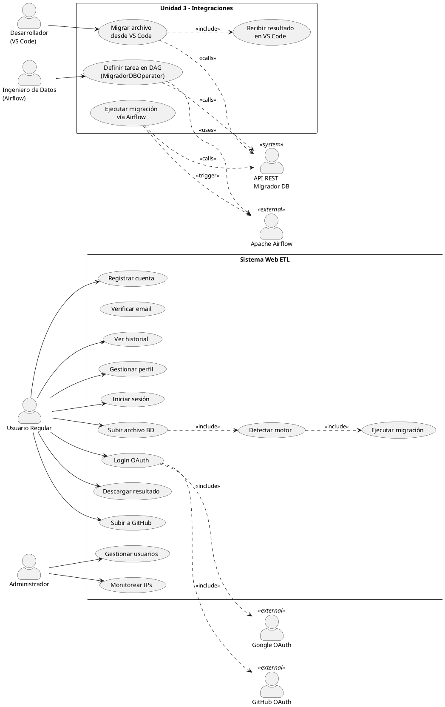
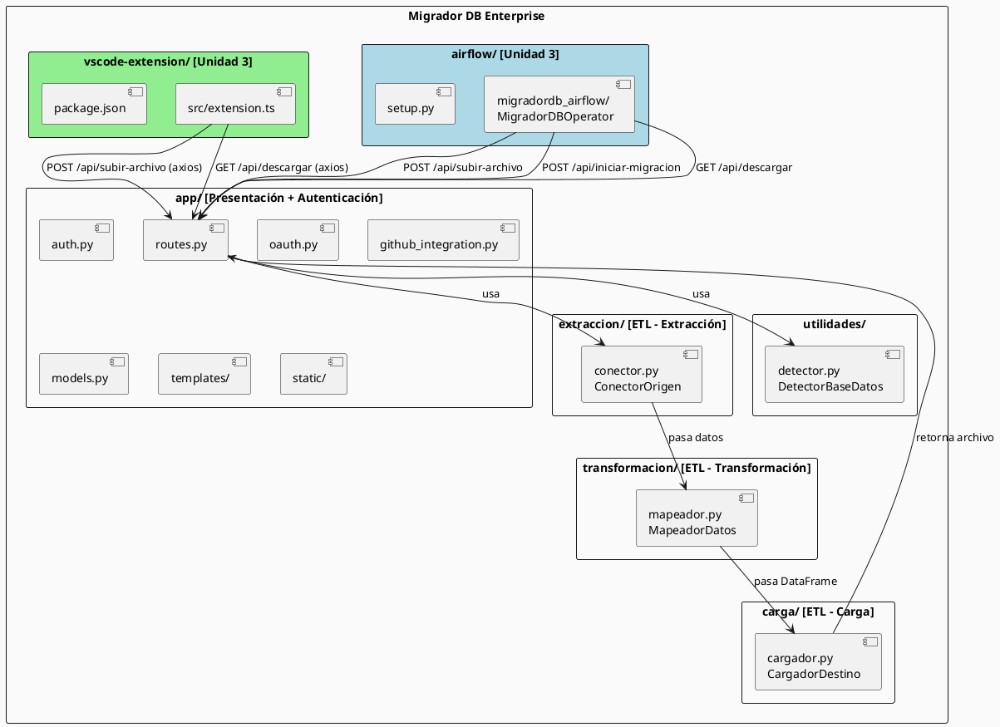
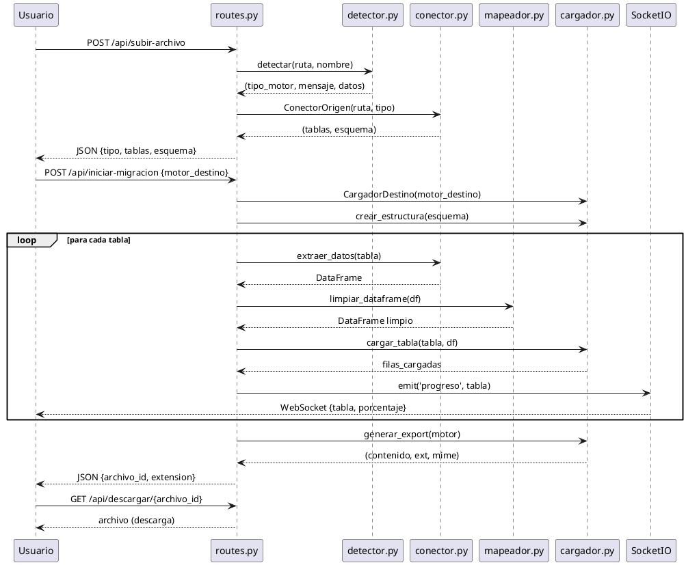
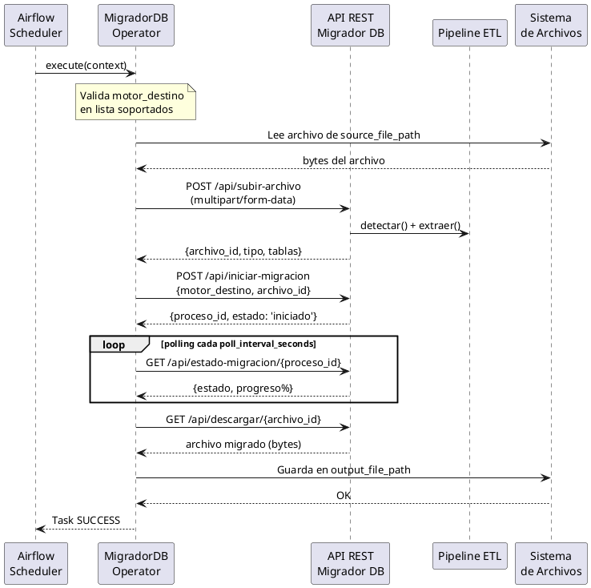
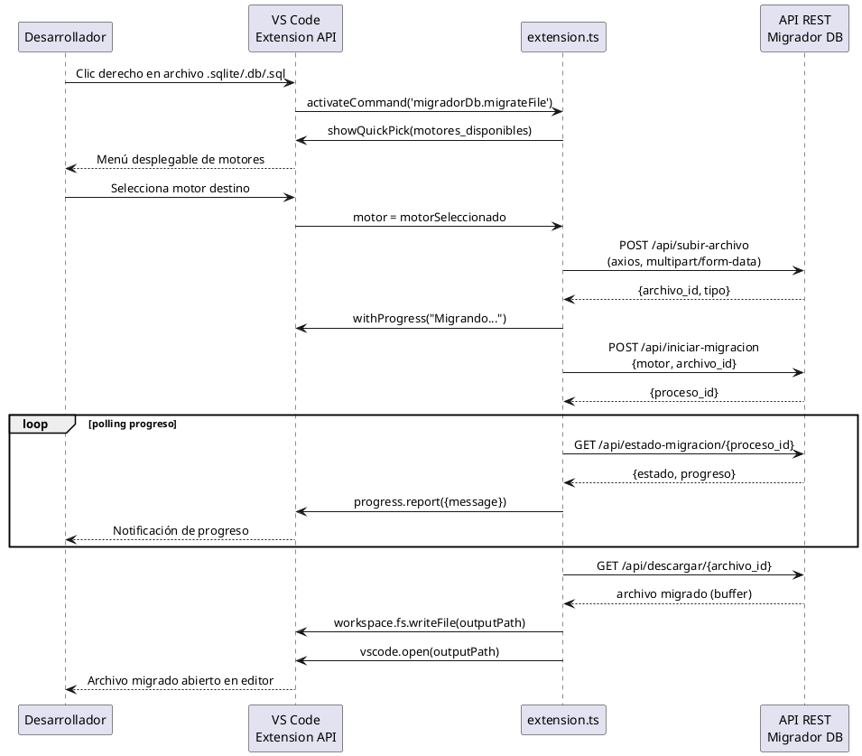
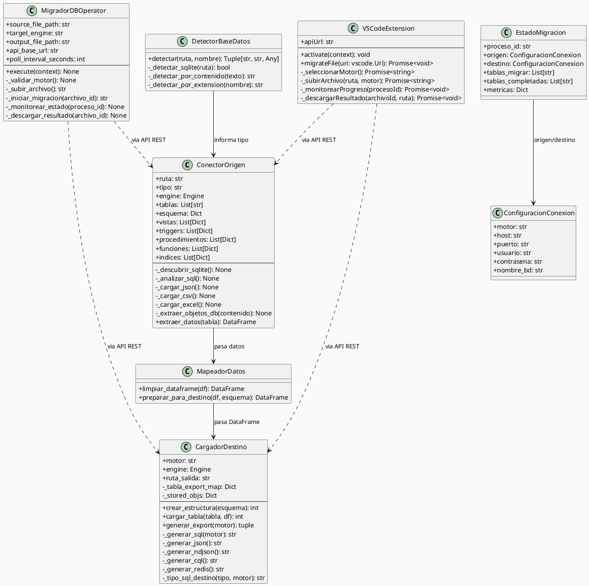

{width="1.0879997812773403in" height="1.4625557742782151in"}

**UNIVERSIDAD PRIVADA DE TACNA**

**FACULTAD DE INGENIERIA**

**Escuela Profesional de Ingeniería de Sistemas**

**Proyecto *Migrador DB Enterprise - Sistema de Migración de Bases de Datos***

Curso: *Ingeniería de Software (SI783)*

Docente: *Mag. Patrick José Cuadros Quiroga*

Integrantes:

***LLica Mamani, Jimmy Mijair***
***Halanocca Rojas, Usher Damiron***

**Tacna – Perú**

***2026***

**\**

<table>
<colgroup>
<col style="width: 10%" />
<col style="width: 12%" />
<col style="width: 15%" />
<col style="width: 16%" />
<col style="width: 11%" />
<col style="width: 33%" />
</colgroup>
<tbody>
<tr>
<td colspan="6" style="text-align: center;">CONTROL DE VERSIONES</td>
</tr>
<tr>
<td style="text-align: center;">Versión</td>
<td style="text-align: center;">Hecha por</td>
<td style="text-align: center;">Revisada por</td>
<td style="text-align: center;">Aprobada por</td>
<td style="text-align: center;">Fecha</td>
<td style="text-align: center;">Motivo</td>
</tr>
<tr>
<td style="text-align: center;">1.0</td>
<td style="text-align: center;">JLM / UHR</td>
<td style="text-align: center;">JLM</td>
<td style="text-align: center;">UHR</td>
<td style="text-align: center;">06/06/2026</td>
<td style="text-align: center;">Versión Original</td>
</tr>
<tr>
<td style="text-align: center;">2.0</td>
<td style="text-align: center;">JLM / UHR</td>
<td style="text-align: center;">JLM</td>
<td style="text-align: center;">UHR</td>
<td style="text-align: center;">04/07/2026</td>
<td style="text-align: center;">Actualización Unidad 3: integración Apache Airflow y extensión VS Code</td>
</tr>
</tbody>
</table>

Sistema *Migrador DB Enterprise*

Documento de Arquitectura de Software

Versión *1.0*

**\**

<table>
<colgroup>
<col style="width: 10%" />
<col style="width: 12%" />
<col style="width: 15%" />
<col style="width: 16%" />
<col style="width: 11%" />
<col style="width: 33%" />
</colgroup>
<tbody>
<tr>
<td colspan="6" style="text-align: center;">CONTROL DE VERSIONES</td>
</tr>
<tr>
<td style="text-align: center;">Versión</td>
<td style="text-align: center;">Hecha por</td>
<td style="text-align: center;">Revisada por</td>
<td style="text-align: center;">Aprobada por</td>
<td style="text-align: center;">Fecha</td>
<td style="text-align: center;">Motivo</td>
</tr>
<tr>
<td style="text-align: center;">1.0</td>
<td style="text-align: center;">JLM / UHR</td>
<td style="text-align: center;">JLM</td>
<td style="text-align: center;">UHR</td>
<td style="text-align: center;">06/06/2026</td>
<td style="text-align: center;">Versión Original</td>
</tr>
<tr>
<td style="text-align: center;">2.0</td>
<td style="text-align: center;">JLM / UHR</td>
<td style="text-align: center;">JLM</td>
<td style="text-align: center;">UHR</td>
<td style="text-align: center;">04/07/2026</td>
<td style="text-align: center;">Actualización Unidad 3: integración Apache Airflow y extensión VS Code</td>
</tr>
</tbody>
</table>

INDICE GENERAL

# Contenido {#contenido .TOC-Heading}

[1. INTRODUCCIÓN](#introduccion-sad)

[1.1. Propósito (Diagrama 4+1)](#proposito-sad)

[1.2. Alcance](#alcance-sad)

[1.3. Definición, siglas y abreviaturas](#definiciones-sad)

[1.4. Organización del documento](#organizacion-sad)

[2. OBJETIVOS Y RESTRICCIONES ARQUITECTONICAS](#objetivos-restricciones)

[2.1.1. Requerimientos Funcionales](#rf-sad)

[2.1.2. Requerimientos No Funcionales – Atributos de Calidad](#rnf-sad)

[3. REPRESENTACIÓN DE LA ARQUITECTURA DEL SISTEMA](#representacion-arquitectura)

[3.1. Vista de Caso de uso](#vista-caso-uso)

[3.2. Vista Lógica](#vista-logica)

[3.3. Vista de Implementación (vista de desarrollo)](#vista-implementacion)

[3.4. Vista de procesos](#vista-procesos)

[3.5. Vista de Despliegue (vista física)](#vista-despliegue)

[4. ATRIBUTOS DE CALIDAD DEL SOFTWARE](#atributos-calidad)

---

<span id="introduccion-sad"></span>
## 1. INTRODUCCIÓN

<span id="proposito-sad"></span>
### 1.1. Propósito (Diagrama 4+1)

Este documento presenta la arquitectura del sistema Migrador DB Enterprise v2.0 utilizando el modelo de vistas 4+1 de Philippe Kruchten. Se describen las vistas de caso de uso, lógica, implementación, procesos y despliegue que conforman la arquitectura completa del sistema, incluyendo las integraciones incorporadas en la Unidad 3: el operador `MigradorDBOperator` para Apache Airflow y la extensión oficial para Visual Studio Code.

La arquitectura de Migrador DB Enterprise se fundamenta en una separación clara de responsabilidades a través de módulos especializados para cada etapa del proceso ETL (Extracción, Transformación y Carga) con algoritmo de procesamiento por bloques (Chunking RAM), complementados por una capa de presentación web basada en Flask, una capa de autenticación multi-proveedor y dos capas de integración externa.

Las decisiones arquitectónicas priorizan:
- **Modularidad**: Cada etapa del ETL es un módulo independiente.
- **Extensibilidad**: Nuevos motores de base de datos se agregan añadiendo lógica en los módulos existentes. Las integraciones externas (Airflow, VS Code) consumen la misma API REST sin modificar el núcleo.
- **Portabilidad**: El sistema funciona tanto en Windows (threading) como en Linux (eventlet).
- **Integrabilidad**: El sistema expone una API REST que permite integración con orquestadores de datos (Apache Airflow) y entornos de desarrollo (VS Code).

<span id="alcance-sad"></span>
### 1.2. Alcance

Este documento cubre la arquitectura del sistema Migrador DB Enterprise completo, incluyendo:
- La estructura de paquetes y módulos del sistema web ETL.
- El flujo de datos a través del pipeline ETL.
- La arquitectura de autenticación y autorización.
- La comunicación en tiempo real con WebSocket.
- El despliegue en producción.
- La arquitectura del operador `MigradorDBOperator` para Apache Airflow (Unidad 3).
- La arquitectura de la extensión oficial de Visual Studio Code (Unidad 3).

<span id="definiciones-sad"></span>
### 1.3. Definición, siglas y abreviaturas

| Sigla | Definición |
|:------|:-----------|
| SAD | Software Architecture Document |
| ETL | Extract, Transform, Load |
| WSGI | Web Server Gateway Interface |
| ORM | Object-Relational Mapping |
| OAuth | Open Authorization |
| WebSocket | Protocolo de comunicación bidireccional sobre TCP |
| Blueprint | Componente modular de Flask para organizar rutas |
| SocketIO | Biblioteca para comunicación WebSocket con fallback |
| SQLAlchemy | Toolkit SQL y ORM para Python |
| Gunicorn | Servidor HTTP WSGI para Python |
| Nginx | Servidor web y proxy reverso |
| Supervisor | Sistema de control de procesos |
| DAG | Directed Acyclic Graph (grafo de flujo de trabajo en Airflow) |
| Operator | Componente atómico de una tarea en un DAG de Airflow |
| PyPI | Python Package Index (repositorio de paquetes Python) |
| VSIX | Formato de paquete de extensión para Visual Studio Code |
| TypeScript | Superconjunto tipado de JavaScript usado para la extensión VS Code |

<span id="organizacion-sad"></span>
### 1.4. Organización del documento

El documento se organiza siguiendo el modelo 4+1:
1. Objetivos y restricciones arquitectónicas.
2. Vista de caso de uso (escenarios).
3. Vista lógica (clases, paquetes, datos).
4. Vista de implementación (componentes de código).
5. Vista de procesos (flujo del sistema).
6. Vista de despliegue (infraestructura física).
7. Atributos de calidad del software.

---

<span id="objetivos-restricciones"></span>
## 2. OBJETIVOS Y RESTRICCIONES ARQUITECTONICAS

### 2.1. Priorización de requerimientos

| ID | Descripción | Prioridad |
|:---|:-----------|:----------|
| RF-01 | Subir archivos de base de datos (hasta 500 MB) | Alta |
| RF-02 | Detección automática del motor de origen | Alta |
| RF-03 | Extracción completa de esquema y datos | Alta |
| RF-04 | Generación de exportaciones multi-motor | Alta |
| RF-05 | Autenticación con OAuth | Media |
| RF-06 | Integración con GitHub | Baja |
| RF-07 | [U3] Operador Airflow `MigradorDBOperator` distribuido en PyPI | Alta |
| RF-08 | [U3] Extensión VS Code con menú contextual de migración | Alta |
| RNF-01 | Rendimiento: 50 MB en < 60s | Alta |
| RNF-02 | Seguridad: hash scrypt, HttpOnly cookies | Alta |
| RNF-03 | Portabilidad: Windows + Linux | Alta |
| RNF-04 | [U3] Compatibilidad: Airflow 2.x + VS Code ^1.80.0 | Alta |

<span id="rf-sad"></span>
### 2.1.1. Requerimientos Funcionales

| ID | Descripción | Prioridad |
|:---|:-----------|:----------|
| RF-01 | Subir y procesar archivos de base de datos en múltiples formatos | Alta |
| RF-02 | Detectar automáticamente el tipo de motor SQL (MySQL, PostgreSQL, SQL Server, Oracle, BigQuery, Snowflake, Redshift, Cassandra) | Alta |
| RF-03 | Extraer esquema completo: tablas, columnas, PKs, FKs, índices, vistas, triggers, procedimientos, funciones | Alta |
| RF-04 | Generar exportaciones SQL nativas con tipos de datos traducidos por motor | Alta |
| RF-05 | Generar exportaciones JSON, NDJSON, CQL y Redis | Media |
| RF-06 | Autenticar usuarios con registro local, Google OAuth y GitHub OAuth | Alta |
| RF-07 | Comunicar progreso de migración en tiempo real vía WebSocket | Media |
| RF-08 | Integrar con GitHub (listar repos, crear repos, subir archivos) | Baja |

<span id="rnf-sad"></span>
### 2.1.2. Requerimientos No Funcionales – Atributos de Calidad

| ID | Descripción | Prioridad | Categoría |
|:---|:-----------|:----------|:----------|
| RNF-01 | Procesar archivos ≤ 50 MB en < 60 segundos | Alta | Rendimiento |
| RNF-02 | Hashing de contraseñas con Werkzeug scrypt | Alta | Seguridad |
| RNF-03 | Cookies HttpOnly + SameSite=Lax | Alta | Seguridad |
| RNF-04 | Aislamiento de archivos por usuario (carpetas separadas) | Alta | Seguridad |
| RNF-05 | Soporte dual: threading (Windows) y eventlet (Linux) | Alta | Portabilidad |
| RNF-06 | Despliegue con Nginx + Gunicorn + Supervisor + Systemd | Media | Operabilidad |
| RNF-07 | Errores del servidor devuelven JSON (no HTML) | Media | Interoperabilidad |

### 2.2. Restricciones

- El sistema está implementado en Python 3.12+ con Flask como framework web.
- El almacenamiento intermedio durante el ETL usa SQLite embebido.
- La autenticación usa SQLite local o MySQL (configurable por variable de entorno `MYSQL_DB`).
- El tamaño máximo de archivo es configurable (por defecto 500 MB).
- En Windows, SocketIO opera en modo threading; en Linux, en modo eventlet.
- **[U3]** El `MigradorDBOperator` requiere Apache Airflow 2.x instalado en el entorno del cliente; el paquete `migradordb-airflow` se instala mediante `pip install migradordb-airflow` desde PyPI.
- **[U3]** La extensión de VS Code requiere VS Code ^1.80.0 y se comunica con la API REST de Migrador DB Enterprise via HTTP; la URL del servidor es configurable en los ajustes del IDE (`migradorDb.apiUrl`).

---

<span id="representacion-arquitectura"></span>
## 3. REPRESENTACIÓN DE LA ARQUITECTURA DEL SISTEMA

<span id="vista-caso-uso"></span>
### 3.1. Vista de Caso de uso

La vista de caso de uso describe los escenarios principales que la arquitectura debe soportar.

#### 3.1.1. Diagramas de Casos de uso

**Diagrama PlantUML – Casos de Uso Generales:**




**Escenario principal: Migración de base de datos (interfaz web)**

| Paso | Actor | Acción | Componente |
|:-----|:------|:-------|:-----------|
| 1 | Usuario | Inicia sesión (local u OAuth) | app/auth.py, app/oauth.py |
| 2 | Usuario | Sube archivo de base de datos | app/routes.py → POST /api/subir-archivo |
| 3 | Sistema | Detecta tipo de motor | utilidades/detector.py → DetectorBaseDatos.detectar() |
| 4 | Sistema | Extrae esquema y datos | extraccion/conector.py → ConectorOrigen |
| 5 | Usuario | Selecciona motor destino | Frontend JS → POST /api/iniciar-migracion |
| 6 | Sistema | Transforma datos | transformacion/mapeador.py → MapeadorDatos |
| 7 | Sistema | Carga en SQLite intermedio | carga/cargador.py → CargadorDestino |
| 8 | Sistema | Genera exportación nativa | carga/cargador.py → generar_export() |
| 9 | Usuario | Descarga resultado o sube a GitHub | app/routes.py → GET /api/descargar o POST /api/github/subir |

**Escenario: Migración vía Apache Airflow (Unidad 3)**

| Paso | Actor | Acción | Componente |
|:-----|:------|:-------|:-----------|
| 1 | Ingeniero de datos | Define DAG con `MigradorDBOperator` | airflow/migradordb_airflow/operator.py |
| 2 | Airflow (Scheduler) | Ejecuta DAG según `schedule_interval` | Apache Airflow Scheduler |
| 3 | MigradorDBOperator | Envía archivo a API REST | POST /api/subir-archivo + POST /api/iniciar-migracion |
| 4 | MigradorDBOperator | Monitorea estado (polling) | GET /api/estado-migracion cada `poll_interval_seconds` |
| 5 | Sistema | Completa migración y guarda archivo | carga/cargador.py |
| 6 | MigradorDBOperator | Descarga y guarda en `output_file_path` | GET /api/descargar |

**Escenario: Migración vía extensión VS Code (Unidad 3)**

| Paso | Actor | Acción | Componente |
|:-----|:------|:-------|:-----------|
| 1 | Desarrollador | Clic derecho en archivo .sqlite/.db/.sql | vscode-extension/src/extension.ts |
| 2 | Extensión | Muestra menú "Migrar con Migrador DB" | VS Code Extension API (menus) |
| 3 | Desarrollador | Selecciona motor de destino | VS Code QuickPick |
| 4 | Extensión | Envía archivo a API REST (`axios`) | POST /api/subir-archivo |
| 5 | Extensión | Monitorea progreso con notificaciones | VS Code Progress API |
| 6 | Extensión | Descarga y abre resultado | GET /api/descargar → vscode.open() |

**Escenario: Administración de usuarios**

| Paso | Actor | Acción | Componente |
|:-----|:------|:-------|:-----------|
| 1 | Admin | Accede al panel de administración | app/routes.py → GET /admin |
| 2 | Admin | Crea nuevo administrador | app/auth.py → crear_nuevo_admin() |
| 3 | Admin | Elimina usuario | app/routes.py → POST /admin/eliminar |
| 4 | Sistema | Notifica al usuario eliminado por email | app/auth.py → enviar_email_notificacion() |

<span id="vista-logica"></span>
### 3.2. Vista Lógica

La vista lógica describe la estructura de clases y paquetes del sistema.

#### 3.2.1. Diagrama de Subsistemas (paquetes)

**Diagrama PlantUML – Diagrama de Paquetes:**




```
Migrador DB Enterprise/
├── app/                        # Capa de Presentación + Autenticación
│   ├── __init__.py            # Factory de la aplicación Flask
│   ├── routes.py              # Blueprint principal (1453 líneas, todas las rutas)
│   ├── auth.py                # Sistema de autenticación (SQLite/MySQL)
│   ├── oauth.py               # Configuración OAuth (Google, GitHub)
│   ├── models.py              # Modelos de datos (dataclasses)
│   ├── github_integration.py  # Integración con GitHub API
│   ├── templates/             # Plantillas HTML (Jinja2)
│   └── static/                # CSS, JavaScript
├── extraccion/                 # Capa de Extracción (E del ETL)
│   └── conector.py            # ConectorOrigen (561 líneas)
├── transformacion/             # Capa de Transformación (T del ETL)
│   └── mapeador.py            # MapeadorDatos (39 líneas)
├── carga/                      # Capa de Carga (L del ETL)
│   └── cargador.py            # CargadorDestino (505 líneas)
├── utilidades/                 # Utilidades del Sistema
│   └── detector.py            # DetectorBaseDatos (211 líneas)
├── airflow/                    # [UNIDAD 3] Operador Apache Airflow
│   ├── migradordb_airflow/    # Paquete MigradorDBOperator
│   ├── example_dag.py         # DAG de ejemplo
│   └── setup.py               # Configuración PyPI
├── vscode-extension/           # [UNIDAD 3] Extensión VS Code
│   ├── src/extension.ts       # Lógica principal (TypeScript)
│   ├── package.json           # Manifiesto (v1.0.2, publisher: jimmyllica)
│   └── migrador-db-vscode-1.0.2.vsix
├── config.py                   # Configuración Flask (variables de entorno)
├── run.py                      # Punto de entrada desarrollo
├── wsgi.py                     # Punto de entrada producción (WSGI)
├── tests/                      # Pruebas del sistema
├── despliegue/                 # Scripts de despliegue
└── docs/                       # Documentación técnica
```

#### 3.2.2. Diagrama de Secuencia – Proceso de Migración (ETL Web)




**Diagrama de Secuencia – Migración vía Apache Airflow (Unidad 3):**




**Diagrama de Secuencia – Migración vía Extensión VS Code (Unidad 3):**




#### 3.2.3. Diagrama de Clases

**Diagrama PlantUML – Diagrama de Clases Principal:**




**Clase: ConectorOrigen** (`extraccion/conector.py`)

| Atributo | Tipo | Descripción |
|:---------|:-----|:-----------|
| ruta | str | Ruta al archivo de base de datos |
| tipo | str | Tipo de motor detectado |
| engine | Engine | Motor SQLAlchemy (solo SQLite) |
| tablas | List[str] | Lista de tablas encontradas |
| esquema | Dict | Esquema de cada tabla (columnas, PKs, FKs, índices) |
| vistas | List[Dict] | Vistas SQL extraídas |
| triggers | List[Dict] | Triggers extraídos |
| procedimientos | List[Dict] | Procedimientos almacenados extraídos |
| funciones | List[Dict] | Funciones SQL extraídas |
| indices | List[Dict] | Índices SQL extraídos |

**Clase: MigradorDBOperator** (`airflow/migradordb_airflow/`) **(Unidad 3)**

| Atributo | Tipo | Descripción |
|:---------|:-----|:-----------|
| source_file_path | str | Ruta del archivo de base de datos origen |
| target_engine | str | Motor de destino (ej. 'PostgreSQL') |
| output_file_path | str | Ruta de salida del archivo migrado |
| api_base_url | str | URL base del servidor Migrador DB Enterprise |
| poll_interval_seconds | int | Intervalo de polling de estado (segundos) |

| Método | Retorno | Descripción |
|:-------|:--------|:-----------|
| execute(context) | None | Punto de entrada del operador Airflow |
| _validar_motor() | None | Valida motor contra lista de soportados; lanza ValueError si no es válido |
| _subir_archivo() | str | Envía el archivo vía POST multipart/form-data; retorna archivo_id |
| _iniciar_migracion(archivo_id) | str | Inicia el proceso ETL; retorna proceso_id |
| _monitorear_estado(proceso_id) | None | Polling del estado hasta completar o lanzar AirflowException |
| _descargar_resultado(archivo_id) | None | Descarga el archivo migrado a output_file_path |

**Clase: VSCodeExtension** (`vscode-extension/src/extension.ts`) **(Unidad 3)**

| Atributo | Tipo | Descripción |
|:---------|:-----|:-----------|
| apiUrl | string | URL del servidor Migrador DB (configurable en ajustes VS Code) |

| Método | Retorno | Descripción |
|:-------|:--------|:-----------|
| activate(context) | void | Registra el comando y el menú contextual en VS Code |
| migrateFile(uri) | Promise\<void\> | Flujo principal: sube archivo, monitorea y descarga resultado |
| _seleccionarMotor() | Promise\<string\> | Muestra QuickPick con lista de motores soportados |
| _subirArchivo(ruta, motor) | Promise\<string\> | Envía archivo via axios; retorna archivo_id |
| _monitorearProgreso(procesoId) | Promise\<void\> | Polling con Progress API de VS Code |
| _descargarResultado(archivoId, ruta) | Promise\<void\> | Descarga archivo y lo abre en el editor |

#### 3.2.4. Diagrama de Base de datos

El sistema utiliza dos bases de datos SQLite:

**1. Base de datos de autenticación** (`auth.db`):
- Tabla `usuarios`: Almacena credenciales y perfiles.
- Tabla `oauth_usuarios`: Almacena vinculaciones OAuth.
- Relación: `oauth_usuarios.usuario_id → usuarios.id` (FK).

**2. Base de datos intermedia ETL** (`uploads/migracion_<motor>.db`):
- Tablas dinámicas creadas durante el proceso de migración.
- Estructura refleja el esquema del archivo de origen con nombres normalizados.
- Se usa como almacenamiento temporal antes de generar la exportación final.

<span id="vista-implementacion"></span>
### 3.3. Vista de Implementación (vista de desarrollo)

#### 3.3.1. Diagrama de arquitectura software (paquetes)

La arquitectura se organiza en capas:


#### 3.3.2. Diagrama de componentes


<span id="vista-procesos"></span>
### 3.4. Vista de procesos

#### 3.4.1. Diagrama de Procesos del sistema

**Proceso 1: Detección automática de motor** (`utilidades/detector.py`)


**Proceso 2: Pipeline ETL**


<span id="vista-despliegue"></span>
### 3.5. Vista de Despliegue (vista física)

#### 3.5.1. Diagrama de despliegue

**Entorno de Desarrollo (Local)**:


**Entorno de Producción (VPS Ubuntu)**:


<span id="atributos-calidad"></span>
## 4. ATRIBUTOS DE CALIDAD DEL SOFTWARE

### Escenario de Funcionalidad

| Atributo | Descripción | Métrica |
|:---------|:-----------|:--------|
| Completitud | El sistema soporta migración entre 15+ motores de BD | Motores soportados: MySQL, PostgreSQL, SQL Server, Oracle, SQLite, MongoDB, Elasticsearch, Cassandra, Redis, Snowflake, BigQuery, Redshift, MariaDB, Db2, Azure SQL |
| Correctitud | Los datos migrados son idénticos a los datos originales | Ratio registros_cargados / registros_extraídos = 100% |
| Detección | El sistema identifica correctamente el motor de origen | Tasa de detección correcta > 95% (validado con test_deteccion_bd.py) |

### Escenario de Usabilidad

| Atributo | Descripción | Métrica |
|:---------|:-----------|:--------|
| Facilidad de aprendizaje | Un usuario nuevo puede completar su primera migración sin documentación | Tiempo < 5 minutos |
| Pasos del proceso | El flujo de migración requiere mínimos pasos | 4 pasos: subir → seleccionar destino → migrar → descargar |
| Feedback visual | El sistema muestra progreso en tiempo real | Actualizaciones vía WebSocket cada tabla procesada |

### Escenario de confiabilidad

| Atributo | Descripción | Métrica |
|:---------|:-----------|:--------|
| Tolerancia a errores | El sistema maneja archivos malformados sin caerse | Excepciones capturadas con respuestas JSON de error |
| Disponibilidad | El servicio web está disponible continuamente | Uptime > 99% con Supervisor para reinicio automático |
| Integridad de datos | Los datos no se pierden ni corrompen durante la migración | Validación de métricas: extraídos == cargados |

### Escenario de rendimiento

| Atributo | Descripción | Métrica |
|:---------|:-----------|:--------|
| Tiempo de respuesta | Detección de motor en archivo de 2 MB | < 1 segundo |
| Throughput | Migración completa de archivo de 50 MB | < 60 segundos |
| Uso de memoria | Procesamiento con Pandas DataFrame | Proporcional al tamaño del archivo |

### Escenario de mantenibilidad

| Atributo | Descripción | Métrica |
|:---------|:-----------|:--------|
| Modularidad | Pipeline ETL separado en 3 módulos independientes | Cada módulo puede modificarse sin afectar los demás |
| Extensibilidad | Agregar soporte para un nuevo motor | Requiere modificar solo CargadorDestino._generar_sql() |
| Documentación | Código documentado con docstrings | Todas las clases y funciones principales tienen docstrings |

### Otros Escenarios

**Portabilidad**: El sistema funciona tanto en Windows como en Linux gracias a la detección automática del modo asíncrono de SocketIO (`threading` en Windows, `eventlet` en Linux). La configuración de producción incluye scripts para Ubuntu (`deploy_ubuntu.sh`, `setup_produccion.sh`) y Windows (`push_vps.ps1`).

**Seguridad**: 
- Contraseñas hasheadas con Werkzeug scrypt.
- Cookies de sesión con HttpOnly, SameSite=Lax.
- Aislamiento de archivos por usuario (carpetas separadas en uploads/).
- OAuth 2.0 con Google y GitHub.
- Middleware ProxyFix para operación detrás de Nginx.
- Manejador global de errores que devuelve JSON (no HTML con información sensible).
