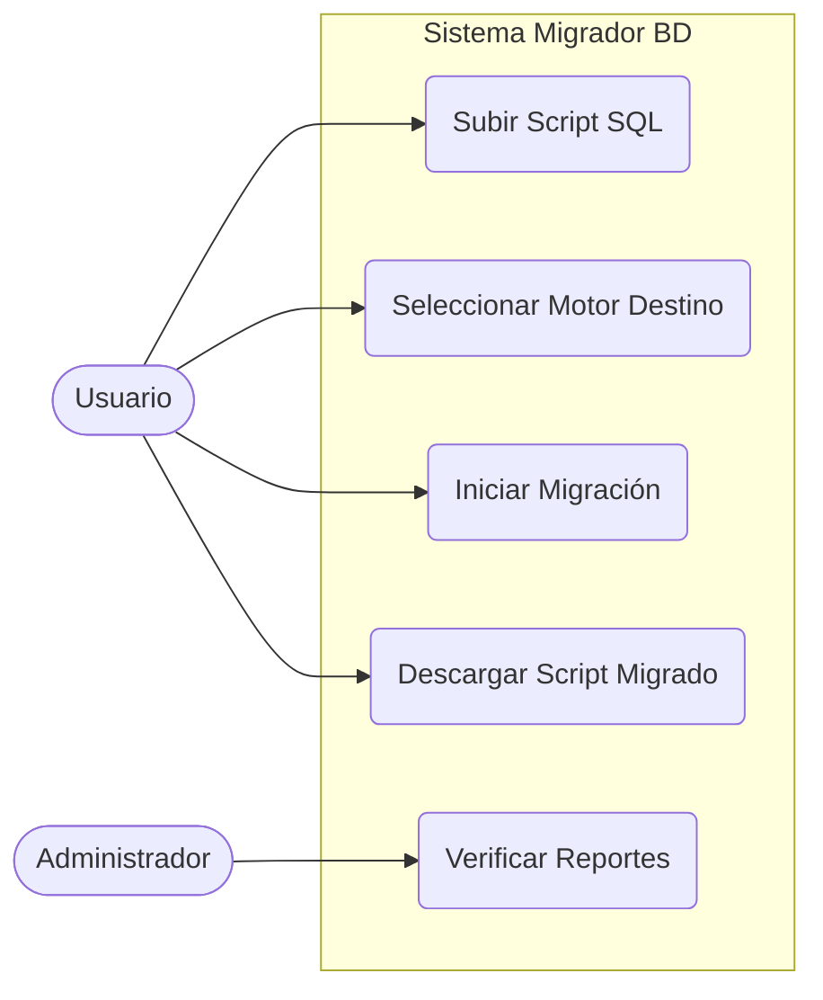
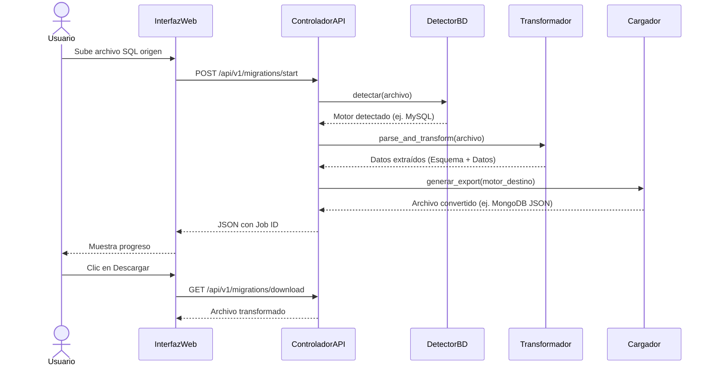
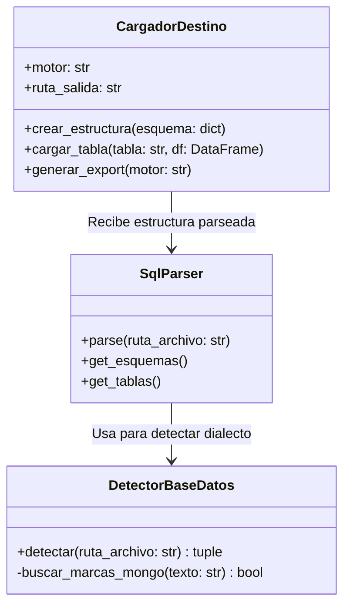
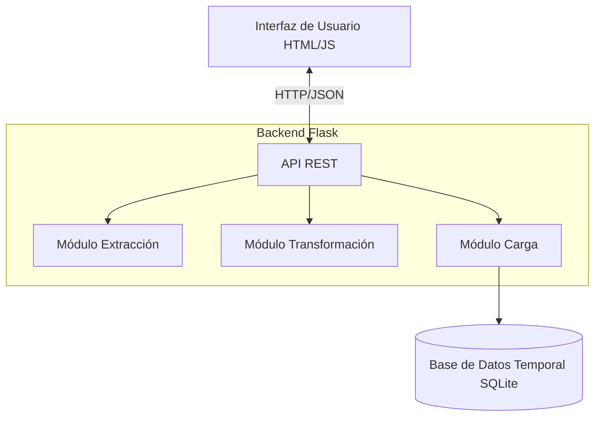
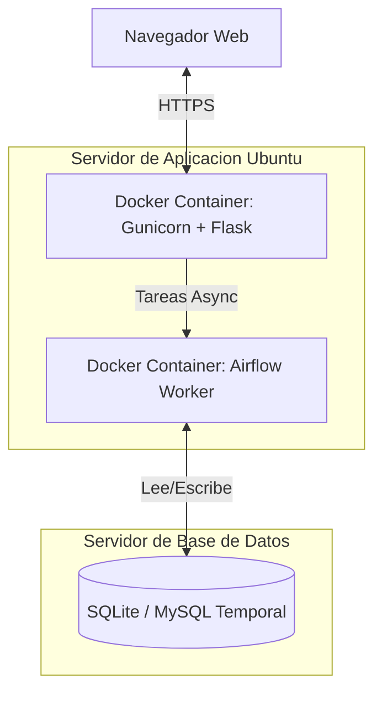

# Informe del Proyecto: Migrador de Base de Datos

## 1. Introducción
El proyecto "Migrador BD" es una herramienta que facilita la transformación y migración de esquemas y datos entre distintos motores de bases de datos. Está construido con Python (Flask) en el backend y permite a los usuarios exportar desde bases de datos relacionales y no relacionales a múltiples destinos.

## 2. Diagramas de Software (UML)

### 2.1 Diagrama de Casos de Uso
Muestra la interacción de los actores con el sistema.

### 2.2 Diagrama de Secuencia
Muestra el flujo paso a paso de una migración.

### 2.3 Diagrama de Clases
Muestra las entidades clave del backend.

### 2.4 Diagrama de Componentes
Muestra los módulos físicos del software.

### 2.5 Arquitectura de Software e Infraestructura (Despliegue)
Muestra cómo se despliega la aplicación.

## 3. Estrategia de Pruebas
- **Pruebas Unitarias e Integración**: Implementadas con `pytest`. Aseguran el correcto funcionamiento de la detección y carga de BD.
- **Pruebas BDD**: Implementadas con `behave` utilizando escenarios Gherkin para la validación funcional.
- **Pruebas de Interfaz de Usuario**: Automatizadas usando `playwright` (pytest-playwright) verificando que el servidor web se levanta y la UI responde.
- **Pruebas de Mutación**: Configuración preparada con `mutmut` para verificar la resiliencia de los tests.

## 4. Análisis Estático y CI/CD
El proyecto emplea GitHub Actions (`ci_pipeline.yml`) para centralizar la verificación en cada *Push* / *Pull Request*:
- **SonarCloud**: Detecta Code Smells y Bugs.
- **Semgrep**: Analiza seguridad de código de forma rápida.
- **Snyk**: Revisa dependencias (`requirements.txt`) en busca de vulnerabilidades conocidas.
- Todo esto, junto a los reportes de pruebas, se publica automáticamente en GitHub Pages.

## Bibliografía
- Martin, R. C. (2008). *Clean Code: A Handbook of Agile Software Craftsmanship*. Prentice Hall.
- Documentación oficial de Flask: https://flask.palletsprojects.com/
- Guía de Mermaid JS: https://mermaid.js.org/
